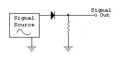

# HWR

A set of conductors used for transmitting electrical signal is called as
<FORM method="POST">
<INPUT TYPE="RADIO" VALUE="A" NAME="cc"> A. Antenna 
<INPUT TYPE="RADIO" VALUE="B" NAME="cc"> B. Transmission gates 
<INPUT TYPE="RADIO" VALUE="C" NAME="cc"> C. Transmission lines 
<INPUT TYPE="RADIO" VALUE="D" NAME="cc"> D. Transformer  
<INPUT TYPE="SUBMIT"> 

</FORM>

