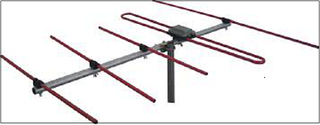
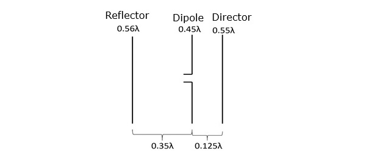
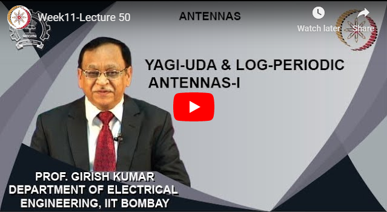

<!DOCTYPE HTML PUBLIC "-//W3C//DTD HTML 4.0//EN" "http://www.w3.org/TR/REC-html40/strict.dtd">
<html><head><meta name="qrichtext" content="1" /><meta http-equiv="Content-Type" content="text/html; charset=UTF-8" /></head>
  <body style=" font-family:'MS Shell Dlg 2'; font-size:8.25pt; font-weight:400; font-style:normal;">

PARASITIC LOADING

 

Yagi-Uda antenna is the most commonly used type of antenna for TV reception over the last few decades. It is the most popular and easy-to-use type of antenna with better performance, which is famous for its high gain and directivity

Frequency range

The frequency range in which the Yagi-Uda antennas operate is around 30 MHz to 3GHz which belong to the VHF and UHF bands.

The figure shows a Yagi-Uda antenna. It is seen that there are many directors placed to increase the directivity of the antenna. The feeder is the folded dipole. The reflector is the lengthy element, which is at the end of the structure.

 

                                                 

 
</body></html>
[Video](https:/www.youtube.com/embed/yCJ7cN2G73g)
