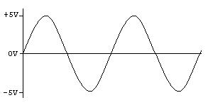
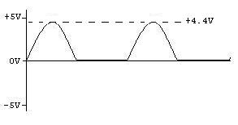

<!-- saved from url=(0065)https://www.eecs.tufts.edu/~dsculley/tutorial/diodes/diodes2.html -->
<html class="gr__eecs_tufts_edu"><head><meta http-equiv="Content-Type" content="text/html; charset=UTF-8">

</head><body link="blue" alink="black" vlink="blue" data-gr-c-s-loaded="true">

<table width="600" align="center">
<tbody><tr>
<td>

<h2 align="center">Half-wave Rectifier</h2>

 
 
<b>Since diodes restrict the flow</b> of current to one direction, they can
be used to convert an AC power supply, which switches polarity from + to -
many times a second, into a straight DC supply.

The simplest rectifier uses one diode, like this:

Called a <em>half-wave rectifier</em>, this circuit takes an AC
signal in and chops off anything that falls below 0 Volts.

Signal In: 

Signal Out (Half-wave): 

The half-wave rectifier is used in AM radios to rectify the signal.  But
for a rectifier in a power supply, it leaves something to be desired -- 
we lose half the power!  Luckily, we can do better.

</td>
</tr>

<tr>
<td>
<h4 align="center">

  

<a href="https://www.eecs.tufts.edu/~dsculley/tutorial/diodes/diodes1.html" target="info">Back</a>

&nbsp;  &nbsp; &nbsp; &nbsp; &nbsp; &nbsp;

<a href="https://www.eecs.tufts.edu/~dsculley/tutorial/diodes/diodes3.html" target="info">Next</a>

</h4>
</td>
</tr>

</tbody></table>

</body></html>
